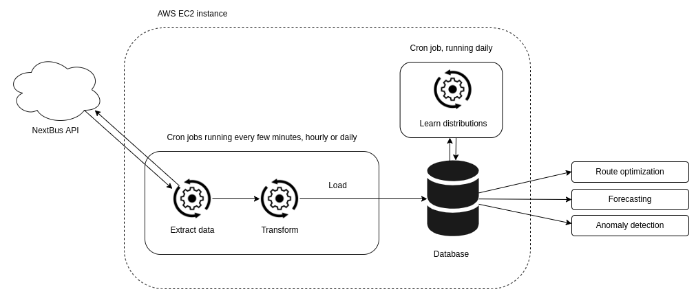

# Route optimization with transit open data

Collect near-time transit data from public APIs and explore solutions to time-dependent (TD) routing optimization problems, such as TD shortest path and TDTSP.

I'm working here with the Toronto Transit Commission (TTC) bus & streetcar data, but any transit agency covered by the [NextBus](https://en.wikipedia.org/wiki/NextBus) [web API](https://retro.umoiq.com/xmlFeedDocs/NextBusXMLFeed.pdf) can be used. I'm actively working on this project, which is still in progress.

&nbsp;

# Project structure 
 
&nbsp;

## 1. Data collection
Transit and location data is collected every 5 min from a fleet of ~2000 vehicles, with week-long retention. 

&nbsp;

## 2. Statistical inference 
How long does this route take during rush hour? What about off-peak?   
Infer transit time distributions from the collected location data. I'm learning to use [PyMC3](https://docs.pymc.io/en/v3/) for this.  

&nbsp;

## 3. Optimization  
The collected data lets us model transit as a weighted directed graph in a few different ways: 

- __Statically__: Nodes are stops connected along routes, with edges weighted by physical distance;
- __Dynamically__: Edges are weighted by time-dependent statistics drawn from the above distributions, such as expected time of transit or 99th percentiles of times taken over all recorded trips. 

&nbsp;

Route optimization for static models can be handled with standard tools (e.g. Dijkstra's algorithm for shortest path, or the Miller-Tucker-Zemlin ILP model for TSP thrown at GLPK). The time-dependent versions are much more difficult and interesting, with the literature pointing towards metaheuristics as one approach I might follow.  

I'm currently learning about all this, and this part is very much a work in progress.

