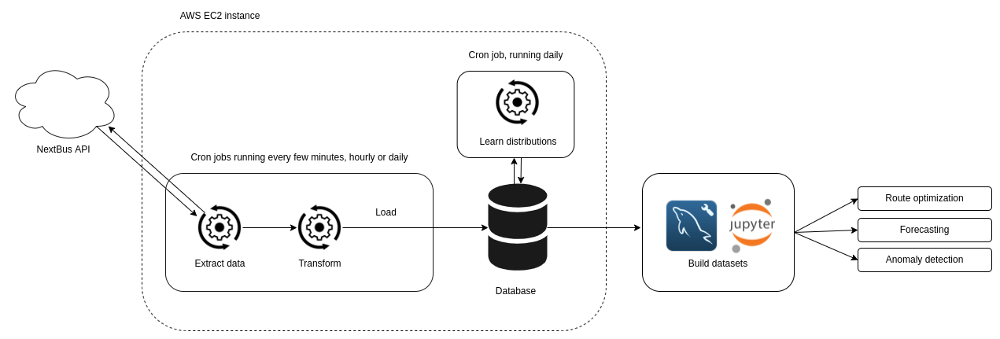

# Route optimization with transit open data

This project collects live transit data from public APIs, which I'm using to experiment with route optimization, forecasting and anomaly detection methods. This is a work in progress. 

I'm working here with the Toronto Transit Commission (TTC) bus & streetcar data, but any transit agency covered by the [NextBus](https://en.wikipedia.org/wiki/NextBus) [web API](https://retro.umoiq.com/xmlFeedDocs/NextBusXMLFeed.pdf) can be used. 

With this project I had a few goals in mind:
- get comfortable with AWS, and build a data pipeline to support this project and the next few;
- setup a benchwork for experimentation;
- learn how to best integrate statistics, machine learning and combinatorial optimization together to solve realistic problems in route optimization, network analysis and adjacent topics;
- finally learn spark. 

Concretely, the current goals are to:
- create & maintain statistical distributions of transit over the TTC network, updating incrementally;
- perform route optimization, which depends on time-of-day; 
- detect network anomalies and reroute around them. 

&nbsp;

# Project structure 
 
&nbsp;

# Things of interest
## Data collection
Location data is collected every minute from a fleet of ~2200 vehicles, with 10 days retention. 

&nbsp;

##  Transit statistics
As you'd expect, the time of transit through the city depends heavily on the hour and traffic conditions. This is highly visible in the data, exemplified in the ridgeline plot below: 

&nbsp;

